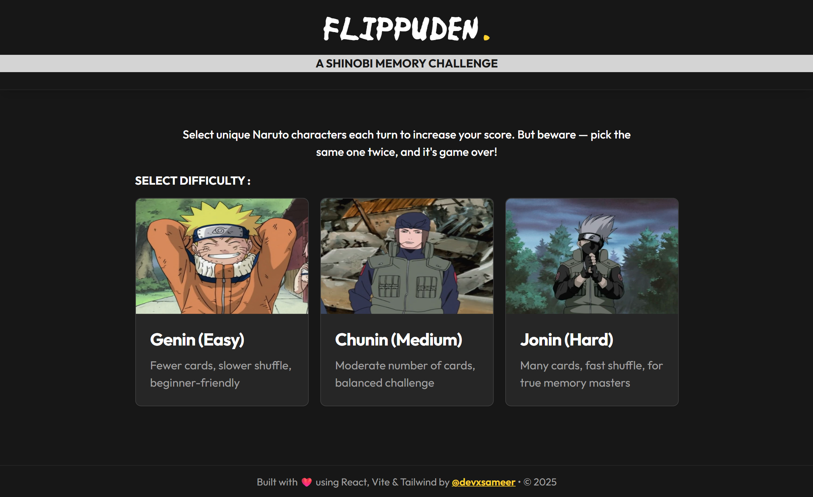
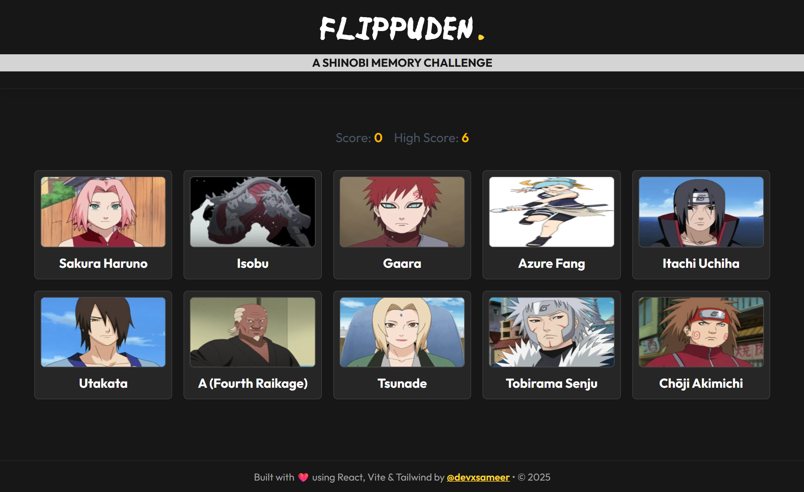

# 🌀 Flippuden: The Naruto Memory Challenge

A fun and interactive memory card game built with **React**, inspired by the world of Naruto!  
Test your memory by flipping unique Naruto characters each turn — but be warned:  
👉 Pick the same one twice, and your ninja journey ends! 💀

---

## 🌟 Features

- ⚡ **Fast & Smooth Gameplay** – Built using **React 19 + Vite** for an ultra-smooth experience.
- 🎴 **Dynamic Shuffling** – Every click reshuffles the cards using the **Fisher–Yates algorithm**.
- 🧠 **Memory Challenge** – Remember which Naruto characters you've picked before.
- 💪 **3 Difficulty Levels**
  - **Genin (Easy):** 10 cards – for rookies and ramen lovers 🍜
  - **Chunin (Medium):** 15 cards – balanced for steady ninjas 🌀
  - **Jonin (Hard):** 20 cards – only for true Hokage-tier brains 🧠🔥
- 🏆 **High Score Saving** – LocalStorage keeps your best score per level.
- 🖼️ **Live Naruto API Integration** – Fetches real character data from [Dattebayo API](https://dattebayo-api.onrender.com/).
- 🚧 **Fallback Image Validation** – Ensures only working character images are displayed.

---

## 📸 Screenshots





---

## 🧩 How to Play

1. Choose your **difficulty level** from the home screen.
2. Click on a **unique Naruto character card** each turn.
3. Each correct choice increases your **score** and reshuffles the board.
4. Select the **same character twice**, and...  
   🌀 _“You lack hatred.”_ — It’s Game Over.
5. Aim for the **highest score possible** before your ninja memory fails!

---

## 💻 Tech Stack

- ⚛️ **React 19**
- ⚡ **Vite** for blazing-fast dev and build setup
- 🎨 **TailwindCSS 4** for modern, responsive styling
- 🎬 **Motion** for fluid animations
- 🧹 **ESLint + Prettier** for code quality and formatting

---

## 🚀 Getting Started

1. Clone the repository:
   ```bash
   git clone https://github.com/devxsameer/flippuden.git
   cd flippuden
   ```
1. Install dependencies:
   ```bash
   npm install
   ```
1. Start the development server:
   ```bash
   npm run dev
   ```
1. Open the app in your browser — the game should auto-launch.

---

## 🧠 Key Logic Highlights

- **Shuffle Algorithm:**  
  Uses Fisher–Yates for true randomness every turn.

- **Image Validation:**  
  Each fetched character image is verified before display.

- **Dynamic Difficulty:**  
  The number of unique cards adjusts based on the difficulty you select.

- **Persistent High Score:**  
  Stored in localStorage and tied to difficulty level.

---

## 🎨 UI & Animations

- Subtle hover & click effects using Framer Motion (motion/react).
- Clean dark theme with TailwindCSS.
- Smooth card transitions powered by AnimatePresence.

---

## 🥷 Future Enhancements

- 🕹️ Add sound effects and background music.
- 🏁 Add leaderboard or online scoring.
- 🌀 Introduce special power-up cards.
- 📱 Improve mobile experience with better card grid layouts.

---

## ⚔️ Credits

- **API:** [Dattebayo API](https://dattebayo-api.onrender.com/).
- **Built with:** React, TailwindCSS, and Motion
- **Developed by:** Sameer Ali 👨‍💻

---

"Hard work is worthless for those that don’t believe in themselves." — Naruto Uzumaki 🍥
